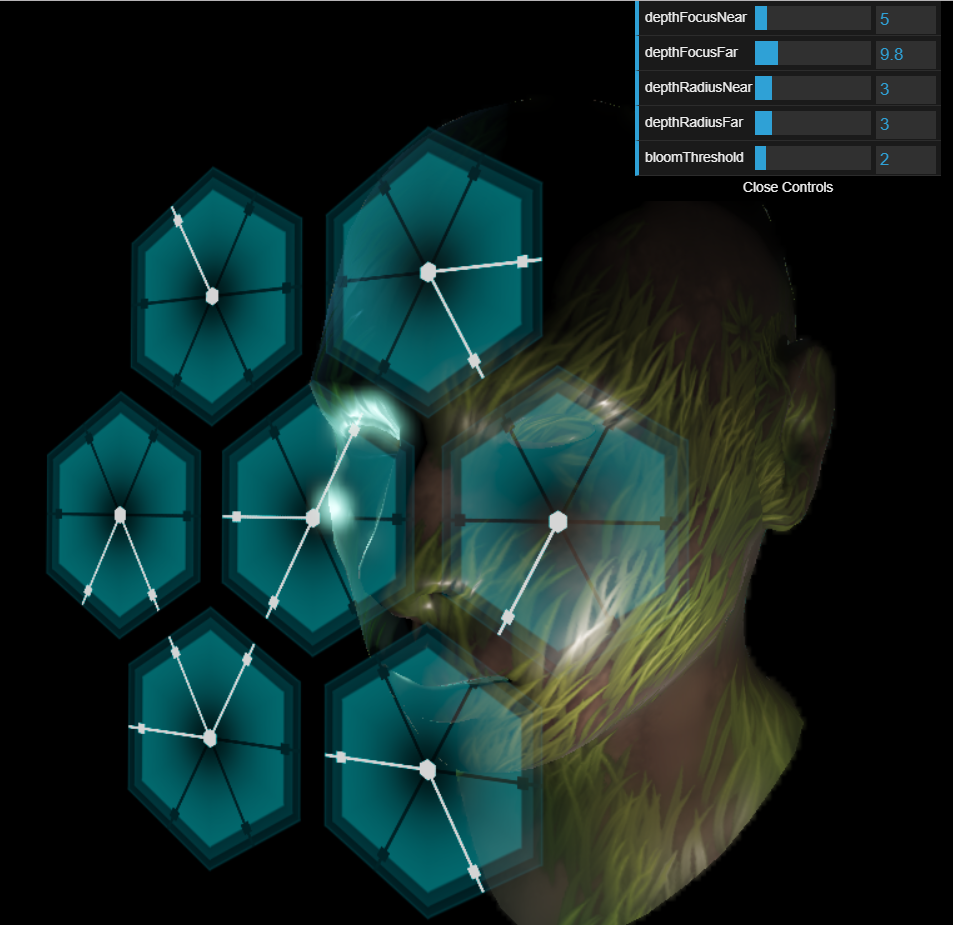

# Readme Under Construction!

This is a fan recreation of the Corpus Hacking Puzzle from Warframe!

# [Play it now!](https://mccannd.github.io/Corpus-Puzzle/)

# The Puzzle Game

# Pipeline

1. Render to GBuffers
2. Render from GBuffers
3. Separable Depth of Field
4. Bloom (2 separable circular, 4 extra horizontal passes)
5. Additive forward alpha blending (fixed camera means no need for depth-T buffer)
6. Tonemap and present

# Shader Tricks

# Thank You!

- The music belongs to Digital Extremes and Warframe. (As does the original puzzle)
- Ausin Eng for the 'hello world' for webgl2
- Jin Kim for feedback and some last minute bug investigation
